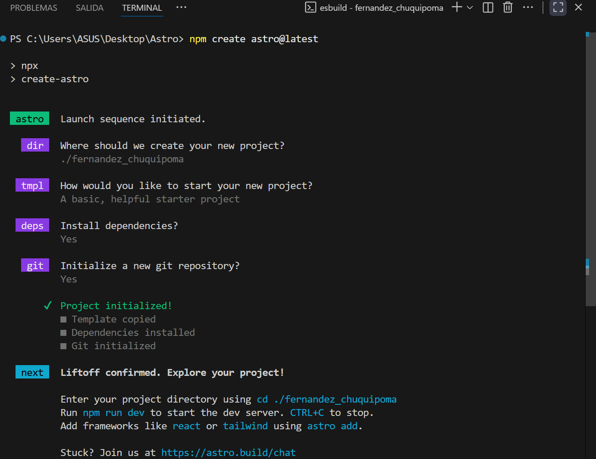
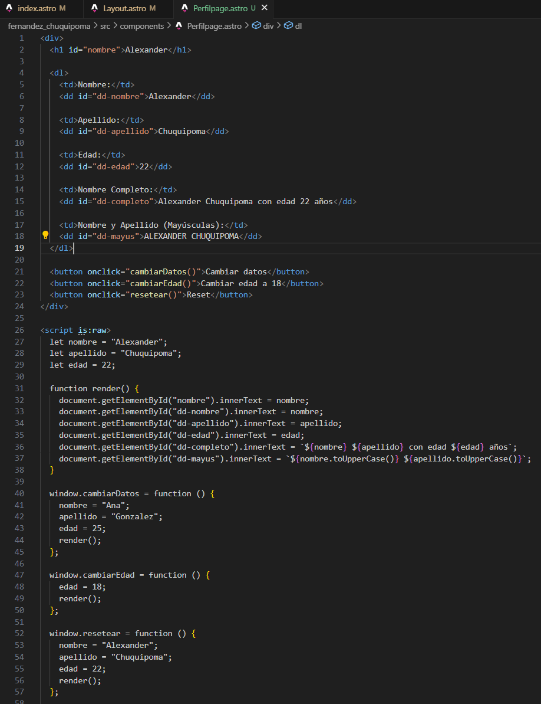
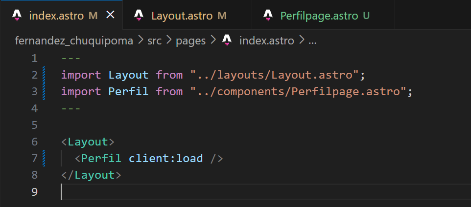
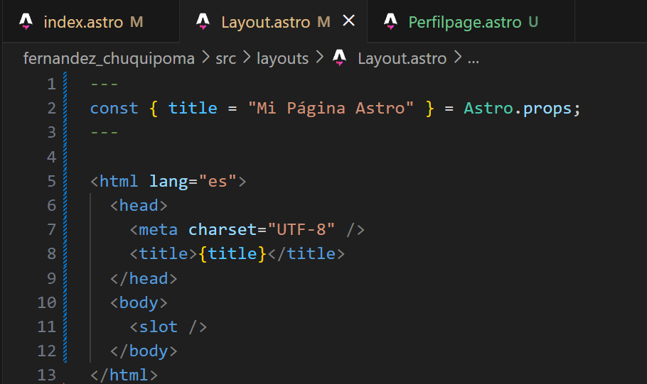
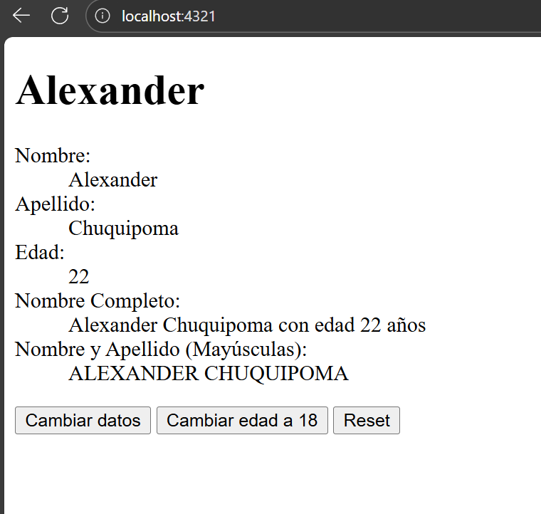

# Programación y Plataformas Web

## Frameworks Web: Astro

<div align="center">
  


</div>

## Práctica 2: Fundamentos

### Autores
**Alexander Chuquipoma**  
📧 [achuquipoma@est.ups.edu.ec](mailto:achuquipoma@est.ups.edu.ec)  
💻 GitHub: [AlexChuquipoma](https://github.com/AlexChuquipoma)

**Juan Fernandez**  
📧 [jfernandezl6@est.ups.edu.ec](mailto:jfernandezl6@est.ups.edu.ec)  
💻 GitHub: [Juan0Fernandez](https://github.com/Juan0Fernandez)

---
## Fundamentos de Astro

### ¿Qué es Astro?
Astro es un generador de sitios moderno y un framework para construir páginas rápidas y optimizadas. Usa renderizado estático por defecto, soporta componentes de múltiples frameworks (React, Vue, Svelte, Solid) y emplea la arquitectura de "islands" para hidratar solo las partes interactivas necesarias.

### Características principales
- Islands architecture: hidratación parcial para mejor rendimiento.
- SSR / SSG: soporte para renderizado en servidor y generación estática.
- Integraciones: plugins oficiales para frameworks, CMS, CSS, etc.
- File-based routing: rutas creadas a partir de archivos en src/pages.
- Markdown + MDX: contenido nativo con frontmatter.
- Client directives: control fino de la hidratación (client:load, client:idle, client:visible, client:only).

---

## Rutas
Astro incluye routing basado en archivos: los archivos en src/pages se mapean automáticamente a URLs. Soporta rutas estáticas, dinámicas (ej. src/pages/blog/[slug].astro), catch‑all (ej. src/pages/docs/[...rest].astro) y endpoints API en src/pages/api/*. El enrutado se resuelve en build/SSR y puedes usar frontmatter para fetch y controlar SSG/SSR.

---

## Instalación de Astro

Astro se puede instalar de diferentes maneras. Aquí los comandos más comunes:

### Usando npm
```bash
# Crear nuevo proyecto
npm create astro@latest

# Instalar en proyecto existente
npm install astro
```

Durante la instalación, se te pedirá:
1. Nombre del proyecto
2. Plantilla inicial (puedes usar starter templates)
3. Configuraciones adicionales (TypeScript, dependencias, etc.)

Una vez instalado, puedes iniciar el servidor de desarrollo:
```bash
npm run dev
```

### Captura de la instalación


---

## Componentes de Astro
Los componentes en Astro son bloques reutilizables que combinan HTML, JavaScript/TypeScript y estilos CSS en un solo archivo con extensión .astro. Cada componente puede contener lógica (frontmatter), la plantilla HTML y estilos (<style>).

Partes principales:
- Frontmatter: bloque superior entre --- para lógica, imports y props.
- Plantilla HTML: estructura visual y bindings.
- Estilos: <style> scoped por componente.

### Creación de un componente
Coloca archivos .astro en src/components. Ejemplo:
```bash
src/components/PerfilPage.astro
```


Este componente muestra información del usuario (nombre, apellido, edad) y botones para modificar valores.

---

## Resultados — Implementación PerfilPage

1. Captura de `index.astro`  
    

2. Captura de `Layout.astro`  
    

3. Captura de `PerfilPage.astro`  
    

4. Captura de la página desplegada  
    

5. Enlace a la página en GitHub Pages:  
   [Github Pages](https://alexchuquipoma.github.io/icc-ppw-u2-02Fundamentos/)

6. Enlace al repositorio del proyecto:  
   [Repositorio](https://github.com/AlexChuquipoma/icc-ppw-u2-02Fundamentos)