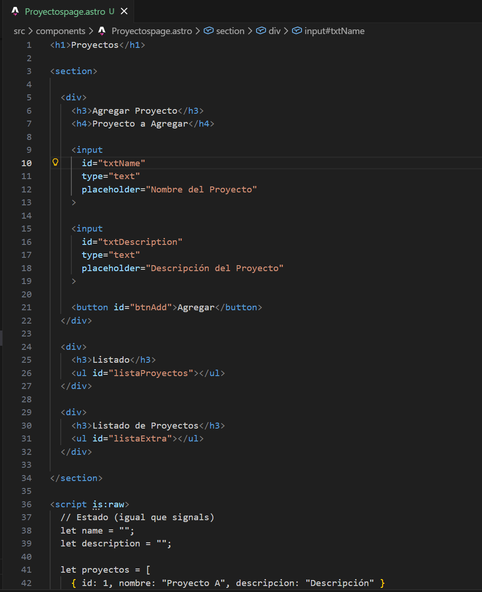
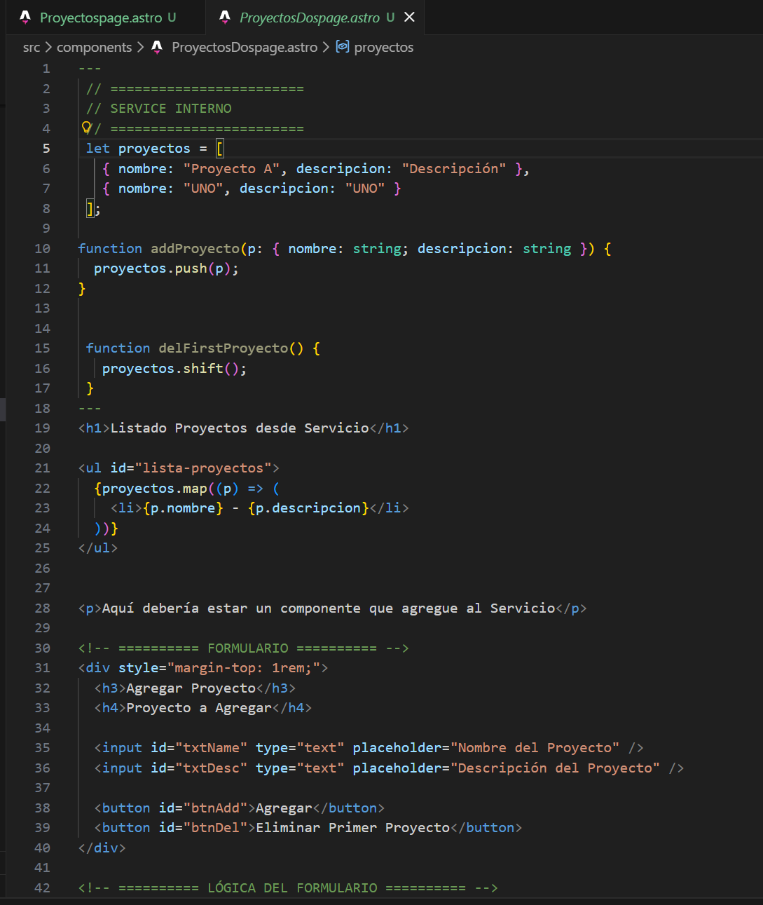
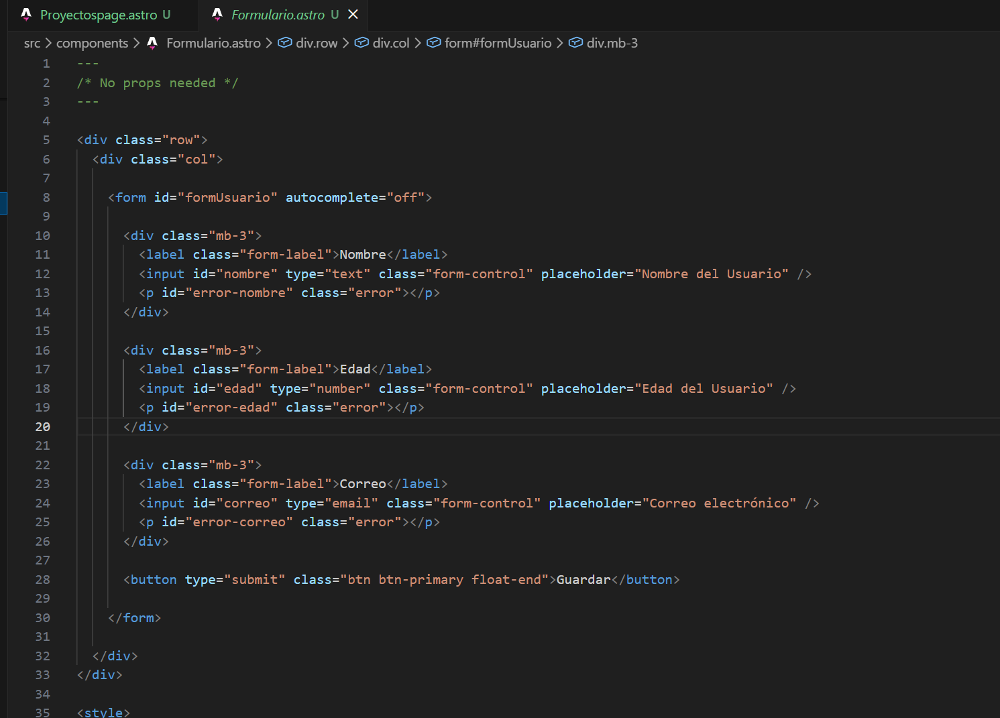
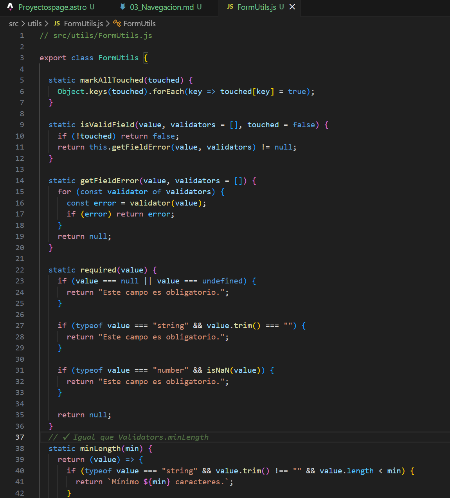
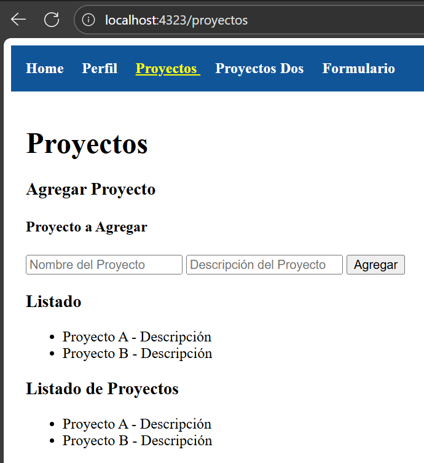
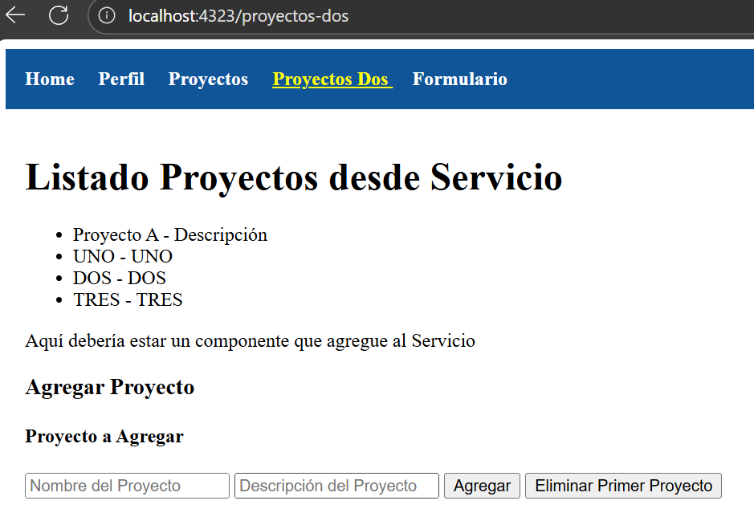
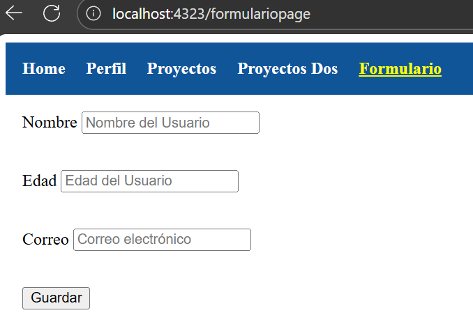

# Programación y Plataformas Web

## Frameworks Web: Astro

  

## Práctica 3: Navegación en Astro

### Autores
**Alexander Chuquipoma**  
📧 [achuquipoma@est.ups.edu.ec](mailto:achuquipoma@est.ups.edu.ec)  
💻 GitHub: [AlexChuquipoma](https://github.com/AlexChuquipoma)

**Juan Fernandez**  
📧 [jfernandezl6@est.ups.edu.ec](mailto:jfernandezl6@est.ups.edu.ec)  
💻 GitHub: [Juan0Fernandez](https://github.com/Juan0Fernandez)

---
## Navegación en Astro

Este proyecto es una implementación sencilla en **Astro** para gestionar
un listado de proyectos mediante **formulario, listado dinámico,
almacenamiento en LocalStorage y eliminación del último elemento
agregado**.

## 🚀 Funcionalidades principales
✔ Agregar proyectos  
✔ Mostrar listado desde localStorage  
✔ Eliminar el último proyecto agregado  
✔ Código separado en componentes Astro  

---

## 📄 Código principal

### proyectos-dos.astro

Archivo que importa el componente principal encargado de manejar el formulario
y la lista:

---
import ProyectosDosPage from "../components/ProyectosDosPage.astro";
<ProyectosDosPage />

--------------------------------------------------------------------------------

### ProyectosDosPage.astro

Este componente contiene:

- Formulario para agregar proyectos
- Guardado en localStorage
- Lectura del listado al cargar la página
- Render dinámico
- Botón para eliminar el último proyecto

### Guardar en localStorage
function saveProyectos(lista) {
  localStorage.setItem("proyectos", JSON.stringify(lista));
}

### Leer desde localStorage
function loadProyectos() {
  const data = localStorage.getItem("proyectos");
  return data ? JSON.parse(data) : [];
}

### Agregar proyecto
proyectos.push({ nombre, descripcion });
saveProyectos(proyectos);

### Eliminar el último proyecto
proyectos.pop();
saveProyectos(proyectos);

--------------------------------------------------------------------------------

## 🧪 Funcionamiento del sistema

1. Se cargan los proyectos desde localStorage.
2. Se renderiza la lista.
3. Al agregar un proyecto:
   - Se añade a la lista,
   - Se guarda en localStorage,
   - Se actualiza el UI.
4. Al eliminar:
   - `pop()` remueve el último elemento,
   - Se guarda la nueva lista,
   - Se actualiza en pantalla.

--------------------------------------------------------------------------------

## Funcionalidad del codigo

1. Captura de `Proyectospage.astro` 
 

Este código permite agregar proyectos a una lista dinámica.
El usuario escribe un nombre y una descripción, presiona Agregar, y el proyecto aparece automáticamente en dos listados. Todo se maneja con JavaScript dentro de la misma página, sin recargarla.

2. Captura de `ProyectosDospage.astro` 
 

Este código implementa un pequeño servicio interno dentro del componente para manejar una lista de proyectos. Permite:

✔ Mostrar proyectos

Los proyectos iniciales se cargan desde localStorage, y si no existe nada, se crea una lista por defecto.

✔ Agregar proyectos

El usuario escribe un nombre y una descripción; el nuevo proyecto se añade a la lista, se guarda en localStorage y se actualiza la vista.

✔ Eliminar el último proyecto agregado

Al presionar el botón, se elimina el último elemento de la lista y se guarda el cambio en localStorage.

✔ Render dinámico

Cada vez que se agrega o elimina un proyecto, la lista se reconstruye automáticamente en pantalla.

3. Captura de `Formulario.astro` 
 

Este formulario permite ingresar nombre, edad y correo, y utiliza FormUtils para validar cada campo.
Cuando el usuario escribe y sale de un input, se muestran errores si el dato es incorrecto.
Al presionar Guardar, se revisan todas las validaciones; si todo está correcto, se muestra un mensaje de éxito y el formulario se reinicia.
En resumen: valida datos en tiempo real, evita envíos incorrectos y gestiona los errores de forma automática.

4. Captura de `FormUtils.js` 
 

FormUtils es una clase utilitaria que contiene funciones de validación para formularios.
Su propósito es validar campos, generar mensajes de error, y controlar cuándo mostrar dichos errores.

- required()  
  Verifica que un campo no esté vacío (texto o número).

- minLength(min)  
  Exige que el valor tenga al menos "min" caracteres.

- email()  
  Valida que el formato del correo sea correcto.

- getFieldError()  
  Ejecuta los validadores asignados y devuelve el primer error encontrado.

- isValidField()  
  Indica si un campo es válido según sus validadores.

- markAllTouched()  
  Marca todos los campos como "tocados" para mostrar errores en pantalla.

 FormUtils permite validar formularios de forma ordenada y reutilizable.
 Evita repetir código y facilita mostrar errores de forma consistente.

 

--------------------------------------------------------------------------------

## Resultados — Despliegue de la pagina

1. Captura de `proyectos`  
    

2. Captura de `proyectos-dos`  
    

3. Captura de `formulariopage`  
    

5. Enlace a la página en GitHub Pages:  
   [Github Pages](https://alexchuquipoma.github.io/icc-ppw-u2-02Fundamentos/)

6. Enlace al repositorio del proyecto:  
   [Repositorio](https://github.com/AlexChuquipoma/icc-ppw-u2-02Fundamentos)